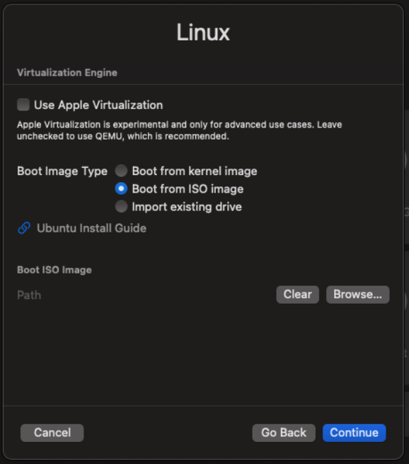
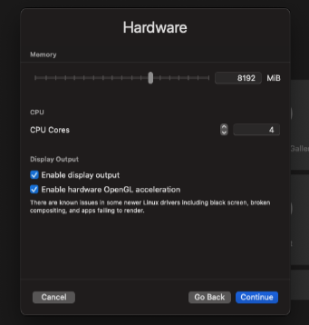

**Week 04 -- Portfolio Entry**

**Explanation of Activities**

Week 4 tutorial focused on the comprehension of routing tables, their
functionality in an attempt to send packets and an explanation of
dynamic routing built on the basis of OSPF in a simulated network.

In Task 1, I developed a GNS3 project called View-Routes-studentid.
Network topology comprised three Linux-based hosts, a Linux-based router
and an Ethernet switch. The two hosts were connected to the router (one
subnet), and the third host connected directly to the router (another
subnet). This installation made it possible to communicate between the
two networks.

**Figure 1: Portfolio Update with Weekly Progress**

All the devices were given a fixed IP address in accordance with two
distinct IPv4 subnets (e.g., 10.1.1.0/24 and 10.1.2.0/24). The router
was set in such a way that it had two interfaces that were connected to
two subnets. With the hosts, a default gateway was created which pointed
to the IP address of the router of the respective subnet.

To change the net.ipv4.IP forwarding to 1 and forwarding packets between
subnets, the router was altered. Forwarding on the hosts was turned off
(net.ipv4.ip_forward=0) to make the hosts act as end devices but not as
routers.

**Figure 2: Linux Virtualisation engine**

After all the nodes had been started, I typed in the following command:

**_ip route show_**

In order to connect the hosts, I used ping tests between different hosts
within dissimilar subnets. The router was correctly routing packets
inter-networks, which was manifested by the effective responses.
Evidence was captured in the form of Routing table screenshots, IP
settings and ping output.

**Figure 3: Hardware**

Task 2 was to import a pre-configured project in GNS3 to have a go at
dynamic routing using OSPF. This network comprised two hosts and four
FRR routers set up with OSPF.

These instructions indicated the neighbour routers, dynamically learned
routes, and the routing table overall utilised to forward.

Then I started by typing in the traceroute command to trace the path
that packets took between two hosts. The initial action was to utilise
traffic according to the optimal trail determined by OSPF. I disabled
one of the NETem nodes and tried to simulate a network failure. This was
followed by an execution of traceroute, which showed that the route had
been altered, demonstrating how OSPF dynamically calculates the routes
whenever there are topological changes.

**Reflection and Learning**

Week 4 provided a better insight into the routing experience in both
intra- and inter-network. I also familiarised myself with the fact that
routing tables are crucial in determining how packets are placed and
that all devices have their own understanding of the network.

A use of the default gateway was among the lessons taken. Without
adequately setting up the gateway on the hosts, the hosts would not be
able to communicate across subnets. This reiterated the essence of a
good network set-up in practice.

Application of IP forwarding on and off helped me to draw a clear
distinction between the roles of hosts and routers. I came to know that
routers must be operational in forwarding packets, but the hosts will
not. This is one of the major differences in network design.

Of interest was the dynamic routing using OSPF. Another difference
between OSPF and traditional routing is that, unlike traditional
routing, OSPF automatically is capable of updating the routing tables
based on network changes. The Resourcefulness and adaptability of
dynamic routing algorithms were noted through the changes in routes as a
result of link failure.

The traceroute tool enabled me to see the actual routes the packets take
on the network. This gave life to the abstract routing concepts, and it
became easier to comprehend.

One of the issues that arose was in decoding routing tables and OSPF
output because they were too technical. However, I would be able to
understand them provided that I focus on such points as destination
networks and next-hop addresses.
