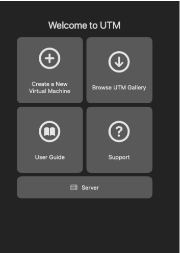
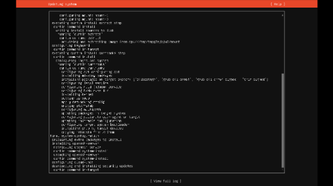
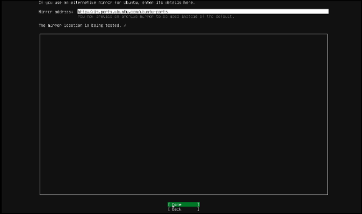

**Week 05 -- Portfolio Entry**

**Explanation of Activities**

Week 5 tutorial included configuring Virtual Local Area Networks ( VLANs
) on a switch, and permitting VLANs to inter-communicate via a router.

In Task 1, I created a GNS3 project named Vlan-Basics-\<studentid\>.
This topology had four Linux hosts, which were connected to an
open-source switch. Each of the hosts was then given an IP address in
the same subnet to check basic connectivity. After starting all the
nodes, I made sure that all of the hosts could communicate with other
hosts using ping.

{width="5.909722222222222in"
height="2.9079002624671917in"}

**Figure 1: Testing Results and Command Output**

The switch was then configured with VLANs to make the network logically
isolated. There were two hosts that were allocated to a single VLAN, and
the remaining two to another VLAN through commands.

After implementing VLAN settings, connectivity tests indicated that in
the same VLAN, hosts could communicate, but in different VLANs,
cross-communication was not possible. This showed the isolation of
network traffic by VLANs. I also checked ARP tables to determine how
addresses got learned only by the devices in its VLAN.

{width="4.878898731408574in"
height="3.2916666666666665in"}

**Figure 2: Reflection and Learning Summary in Portfolio**

Task 2, in which I was able to set up a Linux router by enabling
communication between VLANs (inter-VLAN routing). This project was
duplicated to Vlan-Router- \<studentid\>. The router was hooked up
between the switch and port eth0.

The router has been configured to allow the traffic of various VLANs by
configuring the switch port.

{width="5.851383420822398in"
height="3.451388888888889in"}

**Figure 3: Code Execution and Output Verification**

The sub-interfaces were given an IP address of the respective subnet of
the VLAN. Hosts were also reconfigured to two different IP subnets
depending on their membership of VLAN.

After configuration, again I tested the connectivity. This was the first
time the hosts were able to communicate with each other through the
router, and this was an indication that inter-VLAN routing was a
success. Network topology, VLANs setup and outputs were captured as
screenshots.

**Reflection and Learning**

Week 5 provided a practical example of VLANs in improving network
organisation and security of a network by breaking it down into smaller
logical groups to improve organisation. I realised that although devices
may be physically linked to the same switch, VLANs may limit traffic and
minimise unnecessary traffic.

Some of the lessons included the difference between access ports and
trunk ports. Access ports are used to join end devices and are part of
one VLAN, whereas trunk ports transmit traffic between two or more
VLANs. It forms a usual notion in the real-world enterprise networks.

Installing VLANs in the router on sub-interfaces was not that simple
initially, especially without understanding of how to have one physical
interface to support a huge number of VLANs. However, after it was
implemented, I realised how routers can be used in the process of
communication between the isolated VLANs.

As also on bare knowledge of the effects of the segmentation and
routing, the value of testing before and after VLAN setting proved
helpful.
