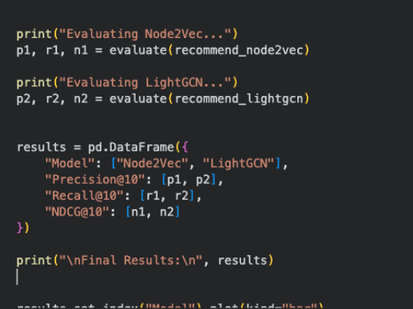
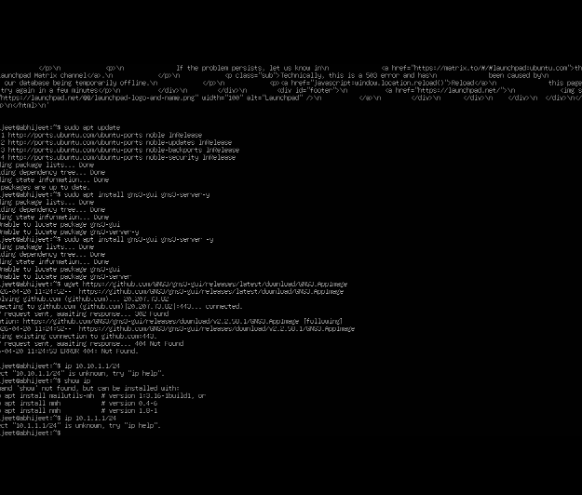

**Week 06 -- Portfolio Entry**

**Explanation of Activities**

In Week 6, the tutorial was about how the devices translate IP addresses
to hardware addresses through the assistance of ARP, and how the default
gateways make communication between various networks possible.

**Figure 1: Evaluation Results of Node2Vec and LightGCN Models Using
Precision, Recall, and NDCG Metrics**

In Task 1, I used the network which I had previously constructed, which
had four Linux hosts, linked together with a switch. The ARP table of
one host (Host A) was analysed. Initially, the ARP table had few or no
entries due to the host not communicating with other devices yet.

I re-examined the ARP table after having sent a ping request to Host B,
sent by Host A. A new line was shown that indicated that the mapping of
the IP address of Host B to the hardware (MAC) address of Host B was
done. This indicated the way in which ARP is used to list the devices in
the local network dynamically in a table.

**Figure 2: Final Portfolio Structure**

Then, when another host (Host C) communicated with Host A, the ARP table
of Host A was updated again. More entries were made, indicating that ARP
is a continuous learner and constantly updates mappings as communication
takes place. I also observed some states in the ARP table, such as
REACHable, which is a valid and active connection. With time, I realised
that entries that are not in use can be cleared, indicating that ARP
tables are dynamic and temporary.

**Figure 3: Output Results**

In Task 2, I created a more complex network, which had two separate LANs
that were connected by two routers. Each LAN had two hosts that were
connected using a switch, and the routers were connected, thus
comprising three subnets.

IP addresses were given to each device, and default gateways were set to
hosts. Routers were forwarding enabled so that they could pass on the
packets between networks, but the hosts were not forwarding enabled. I
have then looked at routing tables after bootstrapping all of the
devices to comprehend my traffic flow between subnets.

And finally, I tested connectivity by ping between hosts on other
subnets. Good communication made default gateways, and routing was
appropriately configured. The IP settings, routing table screenshots and
the ping success were recorded.

**Reflection and Learning**

This week made me realise two basic concepts of networking: ARP and
default gateways. I also got to know that ARP is the one that is
relevant in communication within a local network since it gets to change
the logical IP address into the physical hardware address. Devices would
not be able to offer data at the data-link layer without ARP.

The dynamic change of the ARP table in real time gave me a more
appropriate idea about the working of networks in real time. It further
showed the role of communication as not only sending out the packets,
but also the role of communication as locating and maintaining
information about the devices.

The second exercise highlighted the role played by default gateways in
bridging networks. I noted that unless there is a well-configured
gateway, devices are not able to communicate outside their local subnet.
This further supported the notion that routers are the intermediaries
between networks.

Among the challenges I encountered was the way of routing tables and
gateways in collaboration. Still, by studying the topic of packet flow
and connectivity tests, I had the opportunity to learn how data flows in
different networks.
